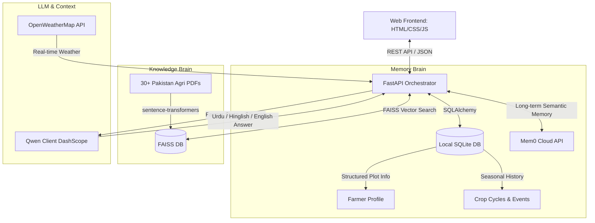

# Kissan AI — Season-Long MemoryAgent for Pakistani Farmers

Kissan AI is a multilingual, weather-aware agricultural assistant for Pakistani farmers that remembers each farmer's plot size, soil, irrigation, crop variety, and past treatments, then answers queries in their native script or style (English, Urdu, or Roman Urdu) using Qwen-based logic grounded in local agricultural documents.

Designed specifically for the **Alibaba / Qwen Cloud Global AI Hackathon (MemoryAgent Track)**.

---

## 🌾 The Problem

Smallholder farmers in Pakistan face critical challenges:
1. **The Extension Gap**: One agricultural officer for thousands of farmers.
2. **Language Barriers**: Most tools are English-first; farmers speak Urdu or Roman Urdu (Hinglish).
3. **Lack of Personalization**: Generic chatbots forget the crop, location, soil, or past sprays.
4. **Ignorance of Local Weather & Guidelines**: Standard LLMs give advice that doesn't respect local variety names, pesticide bans, or upcoming rain.

---

## 🚜 Kissan AI Solution

A **dual-brain** architecture tailored for local fields:
* **The Memory Brain (SQLite + Mem0)**: Remembers farmer profile and seasonal crop cycles (sowing → observations → harvest history) directly from natural chat.
* **The Knowledge Brain (Local RAG)**: Grounded in 30+ official Pakistani agricultural manuals, calendars, and tables.
* **LLM Engine (Qwen-plus / compatible)**: Understands and replies in script-detected English, Urdu, or Roman Urdu (Hinglish).
* **Weather Brain (OpenWeatherMap)**: Dynamically delays sprays if wind is high or rain is imminent.
* **Web Speech API**: Real-time, voice-to-text input in Urdu or English.

---

## 🛠️ Architecture



---

## ✨ Features Implemented

1. **Intelligent Memory Fact Extraction**: Uses Qwen in JSON structured-output mode to parse free-text chat and automatically update crop cycles, location, or fertilizer events in the database.
2. **Grounded RAG Pipeline**: Embeds and indexes local Pakistani agricultural PDFs using `sentence-transformers/paraphrase-multilingual-MiniLM-L12-v2` and `FAISS` with auto-reloading capability.
3. **Citations & Sources in UI**: Beautiful, interactive accordions that show the exact documents referenced by the RAG search.
4. **Speech-to-Text (Urdu / English)**: Functional Web Speech API integration that transcribes voice messages live.
5. **Weather-Aware Advisories**: Automatic field notifications (e.g., hold watering, delay spraying, disease scouts).

---

## 📁 Project structure (Render-ready)

```
kissan-ai/
├── backend/                 # Python / FastAPI
│   ├── app/
│   │   ├── main.py          # Entry point (serves API + static/)
│   │   ├── config.py
│   │   ├── models.py
│   │   ├── db.py
│   │   ├── qwen_client.py
│   │   ├── memory_engine.py
│   │   ├── language_detector.py
│   │   ├── agents.py
│   │   ├── weather_service.py
│   │   └── api/routes/      # auth, chat, weather, health
│   ├── data/
│   │   ├── raw_pdfs/
│   │   └── vector_index/    # FAISS index (commit for deploy)
│   ├── requirements.txt
│   ├── Dockerfile
│   └── .env                 # NOT in git (see .env.example)
├── static/                  # Frontend served by FastAPI
│   ├── index.html
│   ├── chat.html
│   ├── login.html
│   ├── weather.html
│   ├── shared.js
│   ├── shared.css
│   └── ...
├── Dockerfile               # Root image used by Render
├── render.yaml              # Render Blueprint
├── docker-compose.yml
├── LICENSE                  # MIT
├── .gitignore
└── README.md
```

---

## 🚀 How to Run

### Prerequisites
* Python 3.10+
* OpenWeatherMap API Key (optional)
* DashScope / Qwen API Key (optional; falls back to a mock system for offline demo)

### Setup & Launch

1. Clone and navigate to the project directory:
   ```bash
   cd kissan-ai
   ```

2. Configure environment variables in `backend/.env` (copy from `backend/.env.example`):
   ```bash
   QWEN_API_KEY=your_dashscope_api_key
   OPENWEATHER_API_KEY=your_openweathermap_key
   FRONTEND_DIR=../static
   PORT=8000
   ```

3. Setup virtual environment and run the backend:
   ```bash
   cd backend
   python -m venv .venv
   .\.venv\Scripts\Activate.ps1   # Windows powershell
   pip install -r requirements.txt
   ```

4. Index the PDFs (only if `data/vector_index/` is missing):
   ```bash
   python ingest.py
   ```

5. Run the FastAPI development server:
   ```bash
   uvicorn app.main:app --reload --host 0.0.0.0 --port 8000
   # or: python -m app.main   # respects PORT env
   ```

6. Open the Web Application:
   * **Login / Onboarding**: [http://127.0.0.1:8000/](http://127.0.0.1:8000/)
   * **Main Chat Interface**: [http://127.0.0.1:8000/chat.html](http://127.0.0.1:8000/chat.html)
   * **Interactive Weather**: [http://127.0.0.1:8000/weather.html](http://127.0.0.1:8000/weather.html)

---

## ☁️ Deploy to Render (hackathon demo)

One Docker web service serves **FastAPI + `static/`**.

### 1. Push this repo to GitHub
Ensure `backend/data/vector_index/` (`index.faiss`, `chunks.json`) and `static/` are committed.

### 2. Create the service
**Option A — Blueprint (recommended)**  
1. [Render Dashboard](https://dashboard.render.com) → **New** → **Blueprint**  
2. Connect `kissan-ai` repo  
3. Apply `render.yaml`

**Option B — Manual Web Service**  
- **Runtime:** Docker  
- **Dockerfile path:** `./Dockerfile`  
- **Health check path:** `/api/health`

### 3. Set environment variables (Dashboard → Environment)
| Key | Value |
|-----|--------|
| `QWEN_API_KEY` | your DashScope key |
| `OPENWEATHER_API_KEY` | your OpenWeather key |
| `JWT_SECRET` | long random string (or leave Blueprint `generateValue`) |
| `ENVIRONMENT` | `production` |
| `FRONTEND_DIR` | `../static` |
| `AUTH_DEV_BYPASS` | `false` |
| `ALLOW_GUEST_LOGIN` | `true` |

### 4. Smoke-test after deploy
- `https://YOUR-SERVICE.onrender.com/api/health` → `{"status":"ok",...}`  
- Open site → **Continue as Guest** → send a chat message  
- Weather page with a city (e.g. Multan)

**Notes**
- Free tier spins down after idle; first request may take ~30–60s (cold start).  
- SQLite is **ephemeral** on free Render (resets on redeploy/restart) — fine for demos.  
- Auth: **Guest** + **email/password** (Clerk removed).

---

## 📹 90-Second Demo Script (For Judges)

### Setup
* Log in as a guest or create a new farmer profile.
* Ensure FAISS index is built and backend is running.

### Flow
1. **Onboarding / Identity Extraction**
   * **User (English)**: *"Hi, I am Ahmad. I farm 5 acres in Multan. I just sowed cotton FH-142 last week."*
   * **Kissan AI**: Welcomes Ahmad, confirms it remembers his location (Multan), land size (5 acres), and crop variety (cotton FH-142).
   * *(Verify: Go to **Profile** page, see the fields are automatically filled!)*

2. **Personalized Multilingual Query**
   * **User (Roman Urdu)**: *"bhai urea kab dalun?"* (Brother, when should I apply urea?)
   * **Kissan AI**: Answers in Roman Urdu, referencing cotton variety (FH-142), location (Multan), its current age (1 week), and quotes the official fertilizer application calendar.
   * *(Verify: Look at the beautiful **Pakistan Agri Science Sources** accordion to see the cited PDF).*

3. **The MemoryAgent Moment (Session Continuity)**
   * Clear the chat window or refresh the browser.
   * **User (Urdu)**: *"سپرے کب کروں؟"* (When should I spray?)
   * **Kissan AI**: Recalls that Ahmad is in Multan growing cotton FH-142 without him restating it. It warns: *"احمد بھائی، ملتان میں اگلے 2 دن موسم صاف رہے گا لیکن ہوا کی رفتار تیز ہے۔ سپرے کچھ دیر کے لیے مؤخر کریں..."* (Uses memory + live weather).
