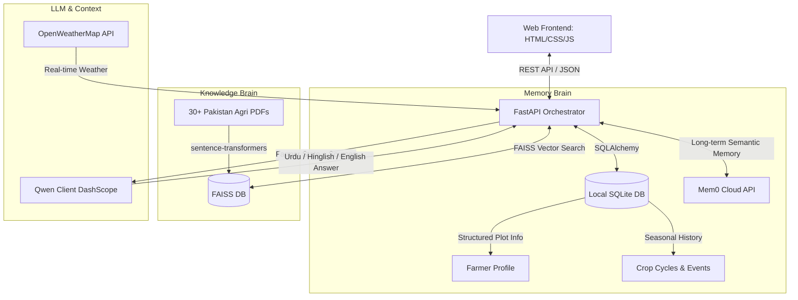

# Kissan AI — Season-Long MemoryAgent for Pakistani Farmers

Kissan AI is a multilingual, weather-aware agricultural assistant for Pakistani farmers that remembers each farmer's plot size, soil, irrigation, crop variety, and past treatments, then answers queries in their native script or style (English, Urdu, or Roman Urdu) using Qwen-based logic grounded in local agricultural documents.

Designed specifically for the **Alibaba / Qwen Cloud Global AI Hackathon (MemoryAgent Track)**.

---

## 🌾 The Problem

Smallholder farmers in Pakistan face critical challenges:
1. **The Extension Gap**: One agricultural officer for thousands of farmers.
2. **Language Barriers**: Most tools are English-first; farmers speak Urdu or Roman Urdu (Hinglish).
3. **Lack of Personalization**: Generic chatbots forget the crop, location, soil, or past sprays.
4. **Ignorance of Local Weather & Guidelines**: Standard LLMs give advice that doesn't respect local variety names, pesticide bans, or upcoming rain.

---

## 🚜 Kissan AI Solution

A **dual-brain** architecture tailored for local fields:
* **The Memory Brain (SQLite + Mem0)**: Remembers farmer profile and seasonal crop cycles (sowing → observations → harvest history) directly from natural chat.
* **The Knowledge Brain (Local RAG)**: Grounded in 30+ official Pakistani agricultural manuals, calendars, and tables.
* **LLM Engine (Qwen-plus / compatible)**: Understands and replies in script-detected English, Urdu, or Roman Urdu (Hinglish).
* **Weather Brain (OpenWeatherMap)**: Dynamically delays sprays if wind is high or rain is imminent.
* **Web Speech API**: Real-time, voice-to-text input in Urdu or English.

---

## 🛠️ Architecture



---

## ✨ Features Implemented

1. **Intelligent Memory Fact Extraction**: Uses Qwen in JSON structured-output mode to parse free-text chat and automatically update crop cycles, location, or fertilizer events in the database.
2. **Grounded RAG Pipeline**: Embeds and indexes local Pakistani agricultural PDFs using `sentence-transformers/paraphrase-multilingual-MiniLM-L12-v2` and `FAISS` with auto-reloading capability.
3. **Citations & Sources in UI**: Beautiful, interactive accordions that show the exact documents referenced by the RAG search.
4. **Speech-to-Text (Urdu / English)**: Functional Web Speech API integration that transcribes voice messages live.
5. **Weather-Aware Advisories**: Automatic field notifications (e.g., hold watering, delay spraying, disease scouts).

---

## 📁 Project structure (Render-ready)

```
kissan-ai/
├── backend/                 # Python / FastAPI
│   ├── app/
│   │   ├── main.py          # Entry point (serves API + static/)
│   │   ├── config.py
│   │   ├── models.py
│   │   ├── db.py
│   │   ├── qwen_client.py
│   │   ├── memory_engine.py
│   │   ├── language_detector.py
│   │   ├── agents.py
│   │   ├── weather_service.py
│   │   └── api/routes/      # auth, chat, weather, health
│   ├── data/
│   │   ├── raw_pdfs/
│   │   └── vector_index/    # FAISS index (commit for deploy)
│   ├── requirements.txt
│   ├── Dockerfile
│   └── .env                 # NOT in git (see .env.example)
├── static/                  # Frontend served by FastAPI
│   ├── index.html
│   ├── chat.html
│   ├── login.html
│   ├── weather.html
│   ├── shared.js
│   ├── shared.css
│   └── ...
├── Dockerfile               # Root image used by Render
├── render.yaml              # Render Blueprint
├── docker-compose.yml
├── LICENSE                  # MIT
├── .gitignore
└── README.md
``

---
